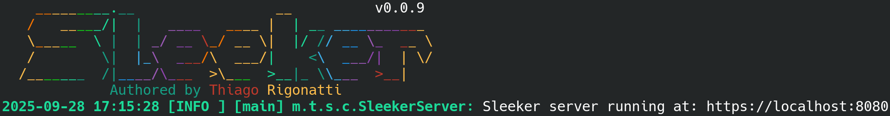

# SLEEKER v0.0.9


[TEST](TEST.md)
```java
public class Test {
    public static void main(String[] args) throws Exception {

        // Creating instances of Http1 and Http2 handler classes.
        final Http1ExampleHandler http1ExampleHandler = new Http1ExampleHandler();
        final Http2ExampleHandler http2ExampleHandler = new Http2ExampleHandler();

        // Creates a builder object for SleekerServer.
        new SleekerServer.Builder()
                // Adds an HTTP context, with an endpoint, a handler that will process the request,
                // and supported HTTP methods.
                .addHttp1Context("/http1_get_post", http1ExampleHandler,
                        HttpMethod.GET,
                        HttpMethod.POST)

                .addHttp1Context("/http1_put_patch_delete", http1ExampleHandler,
                        HttpMethod.PUT,
                        HttpMethod.PATCH,
                        HttpMethod.DELETE)

                .addHttp1Context("/http1_head", http1ExampleHandler, HttpMethod.HEAD)

                // Configures SSL with cert file and private key.
                .withSsl(Path.of("localhost-cert.pem"), Path.of("localhost-key.pem"))

                .addHttp2Context("/http2_get", http2ExampleHandler, HttpMethod.GET)
                .addHttp2Context("/http2_post", http2ExampleHandler, HttpMethod.POST)

                // Builds a SleekerServer object.
                .build()

                // Starts the server with the address and port, as well as the type of I/O used.
                .startServer(new InetSocketAddress("localhost", 8080), ServerIo.TypeIoUring);
    }
}
```
```md
2025-09-29 10:00:01 [INFO ] [main] m.t.s.c.SleekerServer: Sleeker server running at: http://localhost:8080
```
### HTTP1.1 HANDLER
```java
public class Http1ExampleHandler extends Http1SleekHandler {

    private static final Logger LOGGER = LogManager.getLogger(Http1ExampleHandler.class);
    private final StringBuilder stringBuilder = new StringBuilder();

    @Override
    protected void handleGET(ChannelHandlerContext ctx, FullHttpRequest msg) throws IOException {

        stringBuilder.setLength(0);

        stringBuilder
                .append("\r\n")
                .append("--------HTTP/1.1 REQUEST--------")
                .append("\r\n")
                .append("method: ").append(msg.method())
                .append("\r\n")
                .append("path: ").append(URI.create(msg.uri()).getPath())
                .append("\r\n");

        for (Map.Entry<String, String> header : msg.headers()) {
            stringBuilder.append(header.getKey()).append(": ").append(header.getValue())
                    .append("\r\n");
        }

        ByteBuf body = ctx.alloc().buffer();
        body.writeCharSequence("Hello from HTTP/1.1", CharsetUtil.UTF_8);
        FullHttpResponse response = new DefaultFullHttpResponse(msg.protocolVersion(), HttpResponseStatus.OK, body);

        response.headers()
                .set(HttpHeaderNames.CONTENT_TYPE, "text/plain; charset=UTF-8")
                .set(HttpHeaderNames.CONTENT_LENGTH, body.readableBytes());
        ctx.writeAndFlush(response);

        stringBuilder
                .append(msg.content().toString(CharsetUtil.UTF_8))
                .append("\r\n")
                .append("--------------------------------")
                .append("\r\n");

        LOGGER.info(stringBuilder.toString());
    }

    @Override
    protected void handlePOST(ChannelHandlerContext ctx, FullHttpRequest msg) {

        stringBuilder.setLength(0);

        stringBuilder
                .append("\r\n")
                .append("--------HTTP/1.1 REQUEST--------")
                .append("\r\n")
                .append("method: ").append(msg.method())
                .append("\r\n")
                .append("path: ").append(URI.create(msg.uri()).getPath())
                .append("\r\n");

        for (Map.Entry<String, String> header : msg.headers()) {
            stringBuilder.append(header.getKey()).append(": ").append(header.getValue())
                    .append("\r\n");
        }

        ByteBuf body = ctx.alloc().buffer();
        body.writeCharSequence("Hello from HTTP/1.1", CharsetUtil.UTF_8);
        FullHttpResponse response = new DefaultFullHttpResponse(msg.protocolVersion(), HttpResponseStatus.CREATED, body);

        response.headers()
                .set(HttpHeaderNames.CONTENT_TYPE, "text/plain; charset=UTF-8")
                .set(HttpHeaderNames.CONTENT_LENGTH, body.readableBytes());
        ctx.writeAndFlush(response);

        stringBuilder
                .append(msg.content().toString(CharsetUtil.UTF_8))
                .append("\r\n")
                .append("--------------------------------")
                .append("\r\n");

        LOGGER.info(stringBuilder.toString());
    }
}
```
### HTTP1.1 REQUEST
```md
2025-10-02 10:37:38 [INFO ] [pool-2-thread-1] m.t.s.a.Http1ExampleHandler:
--------HTTP/1.1 REQUEST--------
method: GET
path: /http1_get_post
Content-Type: text/plain
User-Agent: PostmanRuntime/7.48.0
Accept: */*
Postman-Token: 957d89bf-61a5-448f-8e17-7fa8abe03ade
Host: localhost:8080
Accept-Encoding: gzip, deflate, br
Connection: keep-alive
Content-Length: 11
123 testing
--------------------------------
```
### HTTP2 HANDLER
```java
public class Http2ExampleHandler extends Http2SleekHandler {

    private static final Logger LOGGER = LogManager.getLogger(Http2ExampleHandler.class);
    private final StringBuilder stringBuilder = new StringBuilder();

    @Override
    protected void handleGET(ChannelHandlerContext ctx, Http2Headers http2Headers, String requestBody,
                             Http2FrameStream stream) throws IOException {

        stringBuilder.setLength(0);

        stringBuilder
                .append("\r\n")
                .append("---------HTTP/2 REQUEST---------")
                .append("\r\n");

        for (Map.Entry<CharSequence, CharSequence> header : http2Headers) {
            stringBuilder.append(header.getKey()).append(": ").append(header.getValue())
                    .append("\r\n");
        }
        stringBuilder
                .append(requestBody)
                .append("\r\n")
                .append("--------------------------------")
                .append("\r\n");

        Http2Headers responseHeaders = new DefaultHttp2Headers()
                .status(HttpResponseStatus.OK.codeAsText())
                .set(HttpHeaderNames.CONTENT_TYPE, "text/plain");

        ByteBuf body = ctx.alloc().buffer();
        body.writeCharSequence("Hello from HTTP/2", CharsetUtil.UTF_8);

        ctx.write(new DefaultHttp2HeadersFrame(responseHeaders, false).stream(stream));
        ctx.writeAndFlush(new DefaultHttp2DataFrame(body, true).stream(stream));

        LOGGER.info(stringBuilder.toString());
    }

    @Override
    protected void handlePOST(ChannelHandlerContext ctx, Http2Headers http2Headers, String requestBody,
                              Http2FrameStream stream) {

        stringBuilder.setLength(0);

        stringBuilder
                .append("\r\n")
                .append("---------HTTP/2 REQUEST---------")
                .append("\r\n");

        for (Map.Entry<CharSequence, CharSequence> header : http2Headers) {
            stringBuilder.append(header.getKey()).append(": ").append(header.getValue())
                    .append("\r\n");
        }
        stringBuilder
                .append(requestBody)
                .append("\r\n")
                .append("--------------------------------")
                .append("\r\n");

        Http2Headers responseHeaders = new DefaultHttp2Headers()
                .status(HttpResponseStatus.CREATED.codeAsText())
                .set(HttpHeaderNames.CONTENT_TYPE, "text/plain");

        ByteBuf body = ctx.alloc().buffer();
        body.writeCharSequence("Saved! (HTTP/2)", CharsetUtil.UTF_8);

        ctx.write(new DefaultHttp2HeadersFrame(responseHeaders, false).stream(stream));
        ctx.writeAndFlush(new DefaultHttp2DataFrame(body, true).stream(stream));

        LOGGER.info(stringBuilder.toString());
    }
}
```
### HTTP2 REQUEST
```md
2025-10-02 10:37:58 [INFO ] [pool-2-thread-1] m.t.s.a.Http2ExampleHandler:
---------HTTP/2 REQUEST---------
:path: /http2_post
:method: POST
:authority: localhost:8080
:scheme: https
content-type: text/plain
user-agent: PostmanRuntime/7.48.0
accept: */*
postman-token: 94fee41a-22a3-48cc-a5a0-66a386c760f3
accept-encoding: gzip, deflate, br
content-length: 11
123 testing
--------------------------------
```
